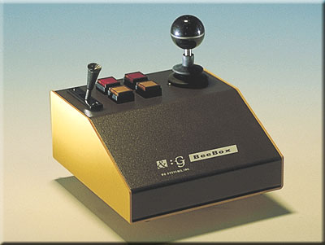

# BeeBox for Java

This package is a development package for Java to use BeeBox on Java platforms.


## Setup

To use the package, you have to install latest Java Communications API. You can get the packages from Sun’s Java site.

## Class Overview

### BeeBox Class

```
public class BeeBox {
  public BeeBox(int device);
  public float getX();
  public float getY();
  public float getLever();
  public void getSwitches();
}
```

#### BeeBox(int device)

This constructor creates an instance that is used to communicate with a BeeBox device. Specify a number of the serial port into the device argument. You can use the platform independent defines BeeBox.SERIAL1 or BeeBox.SERIAL2.

#### float getX()

This method returns a current horizontal position of the stick.

#### float getY()

This method returns a current verticality position of the stick.

#### float getLever()

This method returns a current position of the lever.

#### int getSwitches()

This method retruns a current switch infomation. Use the following constants are defined in the class to determine whether the buttons are currently pressd.

CONSTANT | VALUE
---|---  
BeeBox.SWITCH1 | 0x0001
BeeBox.SWITCH2 | 0x0002
BeeBox.SWITCH7 | 0x0004
BeeBox.SWITCH8 | 0x0008

For example, If you want to know whether the switch1 is currently pressed ....

```
BeeBox bee = new BeeBox( .... );
int switch = joy.getSwitches();
if ((switch & BeeBox.SWITCH1) != 0)
    ........
```

## Sample

### Input Device Driver for Java3D

This is a simple input device driver for Java3D using the BeeBox driver, and you can walk in the world using BeeBox.


Moving the stick forward or backward moves forward or backward along Z axis. Moving the stick right or left yaws around Y axis. Moving the lever up or down moves up or down along Y axis. When the switch7 and the switch8 are pressed, the position is reseted.

## Revision

Revision | Date | Note
---|---|---
1.0 | 1999/05/20 | The first release.

## License

This package is provided "AS IS". Licenser disclaims all warranties,
including but not limited to, all express or implied warranties of
merchant ability and fitness for a particular purpose. Everyone can use
the package for commerce or personal purposes free.
